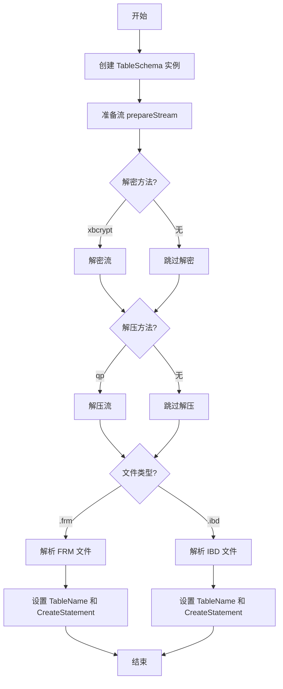
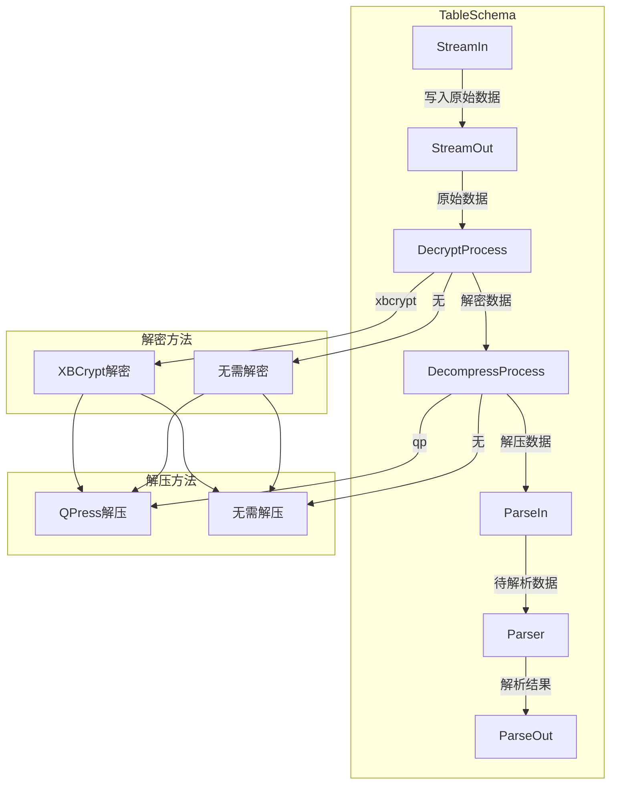
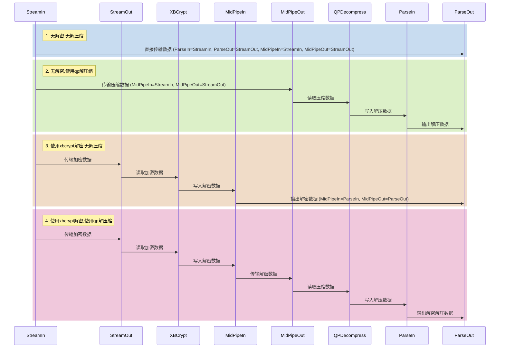

```mermaid
graph TD
    A[开始] --> B[创建 TableSchema 实例]
    B --> C[准备流 prepareStream]
    C --> D{解密方法?}
    D -- xbcrypt --> E[解密流]
    D -- 无 --> F[跳过解密]
    E --> G{解压方法?}
    F --> G
    G -- qp --> H[解压流]
    G -- 无 --> I[跳过解压]
    H --> J{文件类型?}
    I --> J
    J -- .frm --> K[解析 FRM 文件]
    J -- .ibd --> L[解析 IBD 文件]
    K --> M[设置 TableName 和 CreateStatement]
    L --> N[设置 TableName 和 CreateStatement]
    M --> O[结束]
    N --> O
```

```mermaid
graph TD
    subgraph TableSchema
        StreamOut --> |原始数据| DecryptProcess
        DecryptProcess --> |解密数据| DecompressProcess
        DecompressProcess --> |解压数据| ParseIn
        ParseIn --> |待解析数据| Parser
        Parser --> |解析结果| ParseOut
        
        StreamIn --> |写入原始数据| StreamOut
    end

    subgraph 解密方法
        DecryptProcess --> |xbcrypt| XBCrypt[XBCrypt解密]
        DecryptProcess --> |无| NoDecrypt[无需解密]
    end

    subgraph 解压方法
        DecompressProcess --> |qp| QPress[QPress解压]
        DecompressProcess --> |无| NoDecompress[无需解压]
    end

    XBCrypt --> QPress
    XBCrypt --> NoDecompress
    NoDecrypt --> QPress
    NoDecrypt --> NoDecompress
```

```mermaid
sequenceDiagram
    participant SI as StreamIn
    participant SO as StreamOut
    participant XB as XBCrypt
    participant MI as MidPipeIn
    participant MO as MidPipeOut
    participant QP as QPDecompress
    participant PI as ParseIn
    participant PO as ParseOut

    rect rgb(200, 220, 240)
        note right of SI: 1. 无解密,无解压缩
        SI->>PO: 直接传输数据 (ParseIn=StreamIn, ParseOut=StreamOut, MidPipeIn=StreamIn, MidPipeOut=StreamOut)
    end

    rect rgb(220, 240, 200)
        note right of SI: 2. 无解密,使用qp解压缩
        SI->>MO: 传输压缩数据 (MidPipeIn=StreamIn, MidPipeOut=StreamOut)
        MO->>QP: 读取压缩数据 
        QP->>PI: 写入解压数据
        PI->>PO: 输出解压数据
    end

    rect rgb(240, 220, 200)
        note right of SI: 3. 使用xbcrypt解密,无解压缩
        SI->>SO: 传输加密数据
        SO->>XB: 读取加密数据
        XB->>MI: 写入解密数据
        MI->>PO: 输出解密数据 (MidPipeIn=ParseIn, MidPipeOut=ParseOut)
    end

    rect rgb(240, 200, 220)
        note right of SI: 4. 使用xbcrypt解密,使用qp解压缩
        SI->>SO: 传输加密数据
        SO->>XB: 读取加密数据
        XB->>MI: 写入解密数据
        MI->>MO: 传输解密数据
        MO->>QP: 读取压缩数据
        QP->>PI: 写入解压数据
        PI->>PO: 输出解密解压数据
    end
```