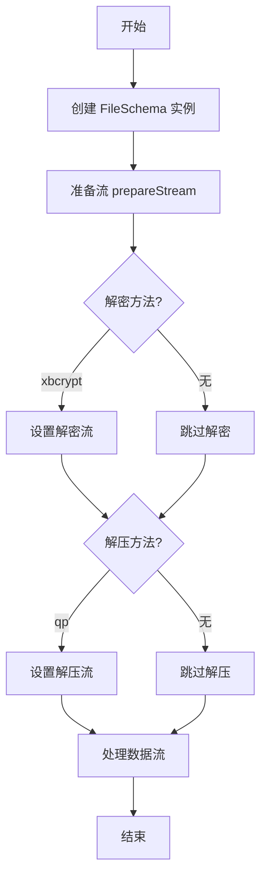
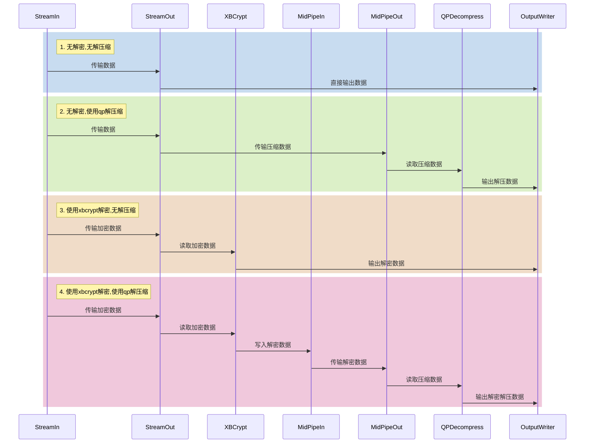

## 文件处理流程说明

FileSchema 提供了四种不同的文件处理流程：

1. **无解密,无解压缩**
   - 数据直接从 StreamIn 流向 StreamOut
   - 最终写入到 OutputWriter

2. **无解密,使用qp解压缩**
   - 数据从 StreamIn 流向 StreamOut
   - 通过 MidPipeOut 传递给 QPDecompress
   - 解压后的数据写入 OutputWriter

3. **使用xbcrypt解密,无解压缩**
   - 加密数据从 StreamIn 流向 StreamOut
   - XBCrypt 处理解密
   - 解密后的数据直接写入 OutputWriter

4. **使用xbcrypt解密,使用qp解压缩**
   - 加密数据从 StreamIn 流向 StreamOut
   - XBCrypt 处理解密
   - 解密后的数据通过 MidPipe 传递给 QPDecompress
   - 解压后的数据写入 OutputWriter

## 错误处理

- 解密错误：记录在 DecryptErr 字段
- 解压错误：记录在 DecompressErr 字段
- 超过提取限制：返回部分处理的数据和错误信息 